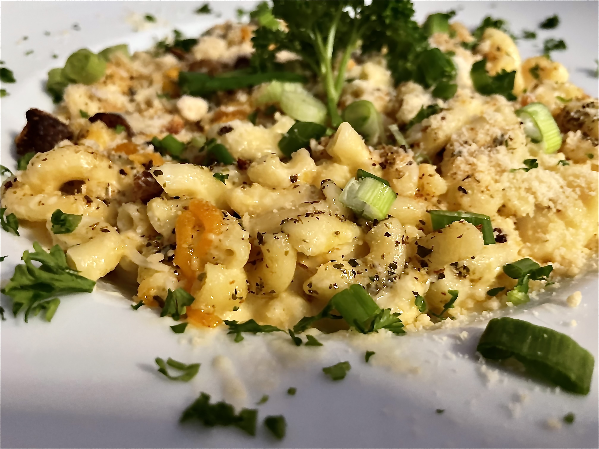

Digging into the steaming, syrup-coated plate of fried chicken and waffles at <a href='https://5cculturalcenter.org/' target='blank'>5C Cafe,</a> I would not have guessed the restaurant is ‘vegan-friendly.’ The four fried, bone-in poultry morsels were clearly prepared with all the care of an expert soul-food chef, trained in the art of meat preparation. 

<a href='https://www.yelp.com/menu/5c-cafe-new-york' target='blank'>5C’s alternative vegan menu,</a> as listed on Yelp, sounds toothsome. I’d gladly take a crack at the the ‘Unchicken and Waffles’, made with pretzel-encrusted seitan, or the ‘Beyond Cheeseburger’ spring rolls with daiya cheese. But after this afternoon’s winning, carnivorous lunch, I’d say 5C has notched a particularly high bar for the vegan food to clear. 

Especially if we’re talking about macaroni and cheese.

  

The macaroni and cheese, billed as a side-dish, came in a large bowl that could easily be deemed ‘family-sized.’ The prospect of having to carry some of my mac home in a doggie bag was ever present, right until the last lick of the plate. 

The elbow macaaroni, swimming in a rich gouda and cheddar sauce and dressed up with breadcrumbs, scallions, parsley and oregano, is a bit of riposte to every over-priced attempt to bougie-up this classic comfort dish. Not since my first childhood bites of noodles with neon cheddar-maltodextrin-and-whey powder have I found mac and cheese so hearty. 

My waitress, a cook, and a bartender all asked me how my food was, with winking smiles, as I dabbed up mac-and-cheese sauce with an edge of waffle. A DJ was also starting to activate his turntables during my meal; college football games played on TVs above the bar.  

Between the friendly vibe, the genius soul food, and the intriguing vegan alternatives, I’d eagerly eat anything 5C deems appropriate to ship out of the kitchen, whether of animal or grain. 

5C Cafe gets a 9.1 out of 10; really, I don’t think I’ve had better soul food in New York. 

Until next time. 

