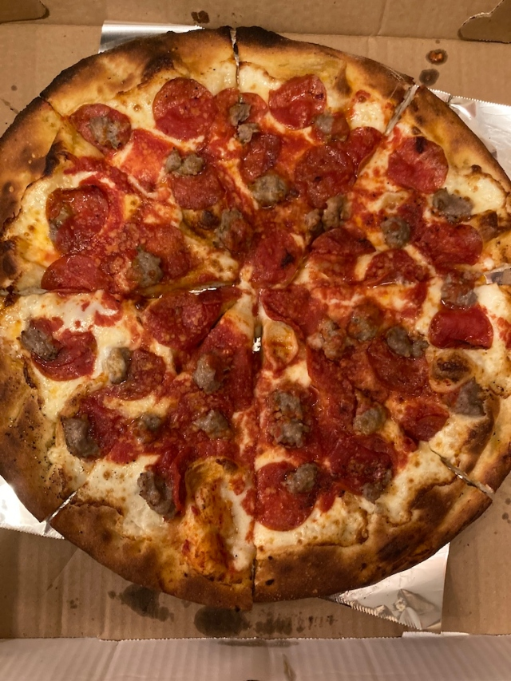

The three minutes I spent inside <a href='https://www.yelp.com/biz/arturos-new-york' target='blank'>Arturo’s Coal Oven Pizza</a> this afternoon felt like I had stepped through a time portal into old New York — dim lighting, smoldering headshots on the walls, a four-piece jazz quartet swinging away on an elevated platform stage. I half-expected a smoky brunette to strut across the bar, blow cigarette smoke in my face and demand I stop staring and buy her a drink.

Arturo’s has been slinging pizza <a href='https://ny.eater.com/2013/3/29/6458861/arturos-a-pizzeria-full-of-old-school-village-charm' target='blank'>at the same corner of Houston and Thompson Street since 1957</a>, so classic Greenwich Village-cool is part of the appeal. I perhaps missed the full Arturo’s charm by picking up my order, but based on those few minutes of jazz-infused magic I would definitely tag this place as a great option for impressing out-of-towners.

Ambiance aside, the big question for me always boils down to: *How is that pizza, tho?*

Opening up the pizza box in my apartment, the pie looked in order and sufficiently coal-oven charred. I was happy to see an abundance of toppings to complement the hefty crust: beautiful red-hot pepperoni coins and stone-colored chunks of sausage married into a thick layer of mozzarella, surrounded by scattered pools of sauce.

The thicker-style crust was sheened with olive oil at the edges, and had fantastic chew and flavor. The only less-than-superior element of the pizza, I thought, was the sauce, which was weak in flavor and a bit soupy.

All told, I thoroughly enjoyed each slice of this pie. Getting through all 8 was a bit of a challenge — but as I’ve said before, I’m not basic. Exactly one episode of [‘Bojack Horseman’](https://www.imdb.com/title/tt3398228/) later, the pizza was vanquished.

I believe the [One Bite scale — from 1 to 10 — may be most appropriate](https://onebite.app/) for Arturo’s coal-oven classic. My score? A 7.7 out of 10. Very good pizza, probably an even greater sit-down experience.

And though the pizza was huge, I still managed to finish a pint of Ben & Jerry's ice cream almost immediately after. How's that for Greenwich Village hip?

Until next time.