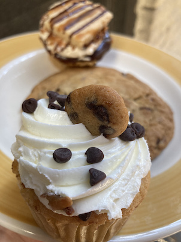

John Nicolaides — former Leo Burnett creative director and Northwestern University advertising professor — probably spent as much time brainstorming the design and brand messaging of <a href='http://www.mollyscupcakes.com/' target='blank'>Molly’s Cupcakes</a> as he did crafting the recipes.

The bakery has a twee backstory — named for John’s third-grade teacher, Miss Molly, who was renowned for her home-baked birthday cupcakes — and a distinctive schoolbus-yellow storefront on the corner of Bleecker and Sixth Avenue. Whimsical details inside evoke the particular nostalgia of a public K-5 elementary school; customers can rock on a swing-seat by the counter, stack Jenga blocks on one of the back tables, or peruse a bookshelf filled with precocious children and young adult literature.

I’m not above reading a copy of "Little Kids First Big Book of the Rainforest" while I yum-yum a cupcake, but Molly’s currently has a limited indoor capacity and a mask-on policy, so I got my pastries to-go this morning.

Molly’s chocolate chip cookies are, I think, one of Greenwich Village’s best kept secrets. When fresh, the cookies are chewy and rich, with generous chocolate chunks and decadent toffee-overtones.

Molly’s cookie this morning, alas, was not the freshest of pastries; my well-intentioned testing of chewiness turned into a hard snap in two (hence the broken cookie in the photo). Based on the dryness, and the fact that the cookies were not available in the display case but had been pulled out of an unseen back-counter location upon my specific request, I wondered if I hadn’t been served a day-old pastry.

Cookies, of course, are a sideshow to the main act, the cupcakes. And boy did the cupcakes shine.

The Samoa cupcake, topped with a chocolate-and-caramel drizzled shortbread cookie and packed with a caramel, buttercream and coconut filling, was a sophisticated harmony of flavor. The disparate mouth-feels woke my senses and melded excellently.

Coconut, especially, is a flavor I’ve come to savor — I even had a coconut cold brew later in the morning! — and in baked goods, I’ve found the meaty texture of the fruit provides a distinctive contrast to butter-and-cream-laden cake.

All told, the Samoa cupcake went down like a champ.

The Cookie Monster, like the chocolate chip cookie, is another item from Molly’s with which I am very familiar. The cake is vanilla chocolate chip, the center is filled with raw cookie dough (Is there egg? Is it safe to eat? I care not either way…) and the frosting is a chocolate-chip studded buttercream which really — truly — melts in your mouth.