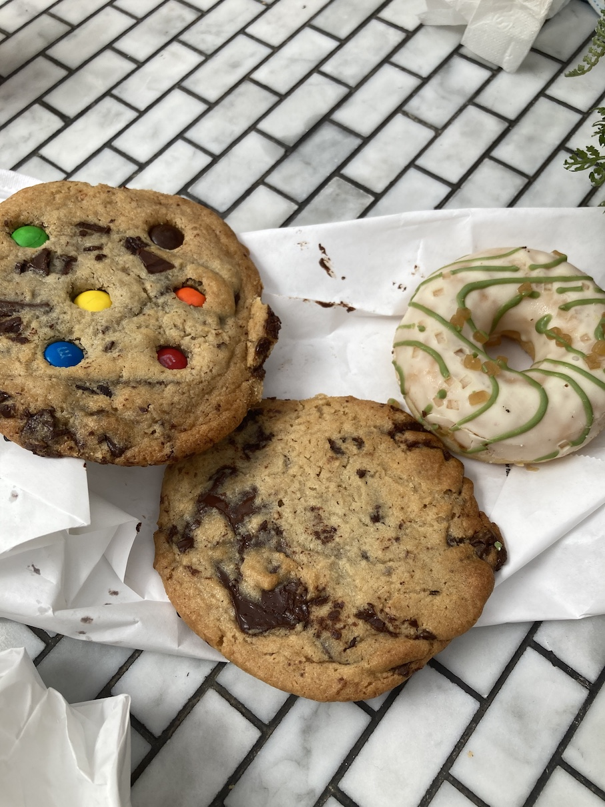

I’m always struck by the Upper East Side’s wildly diverse array of bakeries, pizzerias, cafes, beer halls and ethnic eateries. For me — a downtown New Yorker for the past five years — UES feels like a land of untapped food gems, waiting to be snuffled out.

Case in point: <a href='https://www.blackstarbakery.com/' target='blank'>Black Star Bakery</a> on York Avenue between 84th and 85th, where I met a friend for coffee and a light bite this afternoon.

Black Star hosts a white, narrow minimalist space and a murderer’s row of in-house baked goods. You’ve got your muffins, your babkas, teensy gluten-free brownie cubes, palm-sized donuts, frosted ‘donut dots’, croissants, and on the plate closest to the register — cookies! Chocolate-chip and M&M cookies, making my heart beat fast; oh, glorious day!

And on top of the extensive menu, Black Star keeps a well-tended patio out back, replete with white umbrellas, white tabletops and fake grass for ideal backyard-summer-in-the-city vibes.

I vanquished my first order — a strawberry-frosted donut dot and M&M cookie — within seconds of sitting down at a patio table. Cue a few more minutes of chatting with my friend, and I was back at the register, picking up two additional cookies — a chocolate-chip and another M&M — and an apple donut.

  

I submitted the second round of food to a photo shoot, with the help of my friend — that potted plant and coffee cup? Her idea. The second and third cookies confirmed that Black Star’s are top-of-the-line — chewy, sweet, chocolatey, and remarkably warm and fresh for the late afternoon.

The apple donut was light and bready; I wouldn’t be surprised if Black Star bakes instead of fries. The little dough-round came layered with a generous spread of sweet apple frosting and moist core of tart apple jelly, making for what I imagine as the perfect breakfast donut.

I would be picking up a Black Star donut every weekend post-run in Central Park, if I didn’t happen to live on the opposite side of town.

Overall, Black Star made for a lovely coffee shop sit-down experience. We were safe and shaded under the patio umbrella, and able to enjoy our food and drinks until the shop closed at 4 p.m..

A five out of five for Black Star Bakery; the place was perfect, what more do you want me to say? Put that cookie on a ‘best-of’ list, give me them donuts after I crush Harlem Hill. Hot vax summer, baby!

Until next time.