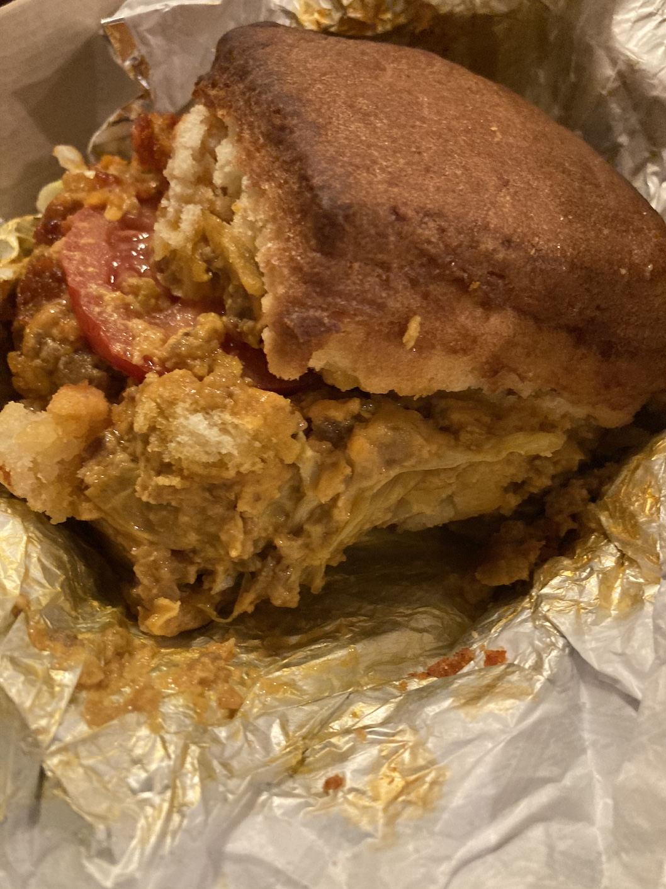

<a href='https://www.butterfunkbiscuit.com/' target='blank'>Butterfunk Biscuit Co.</a> is the brainchild of Chef Chris Scott, who uses his family's fourth-generation biscuit recipe across a wide swath of regional touchpoints from New York City and the American South. The Smoked Salmon Biscuit, Avocado Toast Biscuit and Crispy Fried Chicken Biscuit are all top-billers on the menu.

Choosing between different comfort food dishes, for me, is like picking a winner in a cute baby contest, so I had some difficulty honing in on one particular option from Butterfunk's menu. After some deliberation, I decided on the Chopped Cheese Biscuit. A chopped cheese, for those unaware, is the uptown New York City bodega order du jour*, akin to a bacon-egg-and-cheese in Midtown, or a hummus wrap and SmartWater in Tribeca.

I finished off my order with the "Berry Berry Good Shortcake" — can’t skip dessert! — and hopped on a Zoom catch-up with a friend while I waited.

When my food arrived, I plopped the bag of goodies on my bed and pulled out the first item at the top of the bag, which turned out to be the shortcake.

Right away, I sensed something was wrong. My berry-shortcake medley looked more like croutons, crème fraîche, and yellow cherry tomatoes with a sprig of parsley.

My friend agreed the whole rigamarole seemed off, as I held up the food to the camera. Audibly crunching into one of the ‘shortcake’ bites confirmed that this dessert was a bit janky.

Unsettled, I put the carton down and decided to wait until later to eat the rest. I didn’t want to cry on a Zoom call.

Twenty minutes later, when I got off the Zoom and dug into the Chopped Cheese Biscuit, my worst fears about Butterfunk were slightly quelled — the sandwich was a delicious, cheesy, beefy symphony. The onions provided crucial grease and crunch, and the biscuit, though a smidge overdone on the exterior, eventually softened into a pleasing bready mush.

  

After scooping up the last of the biscuit and beef, I tentatively tucked into the shortcake; this second go-round proved slightly more — ahem — fruitful. The yellow balls turned out to be fresh gooseberries, tart and juicy, and the sliced strawberries and blueberries were also perfectly ripe. Healthy dollops of whipped cream did just enough to moisten the bread bites into a palatable dessert.

If I had read the menu carefully, of course, I would have noticed the shortcake description specifically called out ‘toasted biscuits' as part of the mix. At first, I thought labeling toasted biscuits 'shortcake' was false advertising; my girlfriend, however, has made clear that shortcake is always a form of biscuit.

I had thought shortcake was basically sponge cake; pardon me for being honest about my ignorance. In either case, Butterfunk's shortcake dessert succumbed to a case of too toasty biscuits; I prefer my cakes to caress, not crunch. I'd give this dish a 3 out of 5.

The Chopped Cheese Biscuit gets a 4 out of 5. The ground beef was hearty, the cheese was melty, the biscuit was, um, toasted. Maybe a little too toasted, which keeps the sandwich from a higher score. Still, I’d absolutely order another Butterfunk biscuit sandwich.

So overall, a 3.5 out of 5 for Butterfunk Biscuit Co. Perhaps their score was a little handicapped by my lack of knowledge about shortcake, but you know, they've pretty much got the Southern biscuit market cornered in New York; they deserve to be held to a high standard.

Until next time.

*For more details on how to make a proper chopped cheese — typically packed into a hero roll with ground beef, onions, melted cheese, tomatoes, lettuce and ketchup, fried to order on a bodega grill — please refer to Harlem rapper Jim Jones’ five-minute lesson.