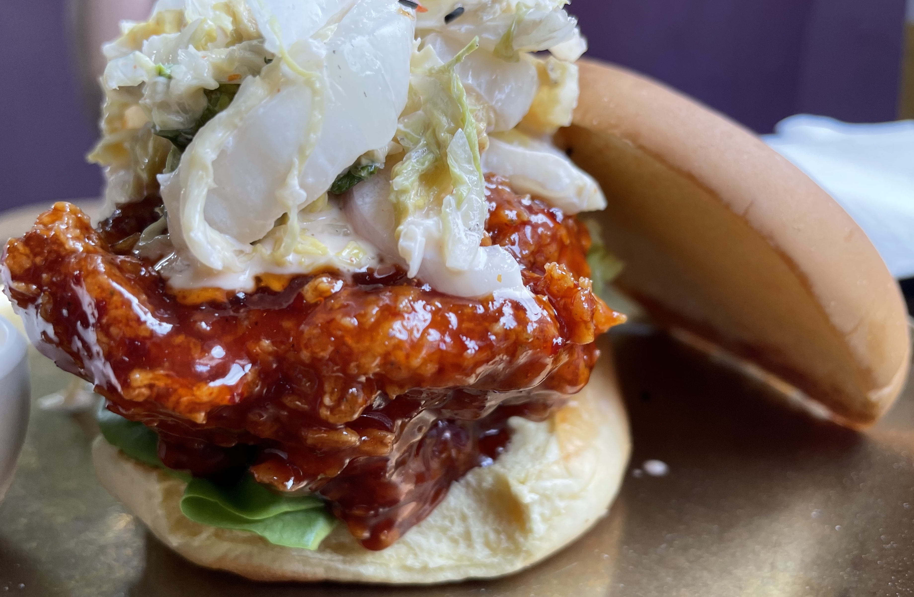

I came upon <a href='https://www.chickchicknyc.com/' target='blank'>Chick Chick</a> by happenstance this past Saturday afternoon, which is not how I usually end up at destination-worthy restaurants. A friend and I were walking from Central Park, musing on things like flowers and photography, when *boom* — the restaurant <a href='https://www.theinfatuation.com/new-york/reviews/chick-chick' target='blank'>The Infatuation called</a> ‘the most exciting place for a quick dinner on a Wednesday night,’ standing before us like a beacon on Amsterdam Avenue. 

Chick Chick’s servers are exceptionally friendly, cooing and waving to children on the street while still running a very efficient table operation. We were seated right away; scanning the QR code menu, I was unexpectedly pulled towards the Chicken & French Toast. The selling point, I think, were the ‘apple chips’ and ‘maple bourbon’ in the recipe list — two delicious things I don’t eat enough of. 

My friend ordered the KSG-Wich (Korean Sweet Gochujang), a white crispy piece of  chicken slathered in spicy Korean Gochujang sauce; our food arrived in under ten minutes. 

Chick Chick is quick-quick. 

My French Toast was soft and gooey — yes, gooey is the right word here, gooey in the way of soft-baked cookies, or how I used to slightly undercook my pancakes. I loved every bite The chicken tender was crispy, salty and sweet from the maple bourbon syrup and powdered sugar; the apple chip was a nice little addendum to the overall savory-sugary palette of the meal. 

The KSG-Wich, I am told, was fantastic; my friend rated this a 9 out of 10. 

For myself, I would rate the Chicken & French Toast an 8.6; absolutely delicious, a worthy meal at any time of day, although I would be curious to see how a full breast or thigh would fare in the dish, instead of a tender. 

So, on average, an 8.8 for Chick Chick; a bit of sweet serendipity on a Saturday afternoon in the Upper West Side. Does life get any better?

Until next time. 
