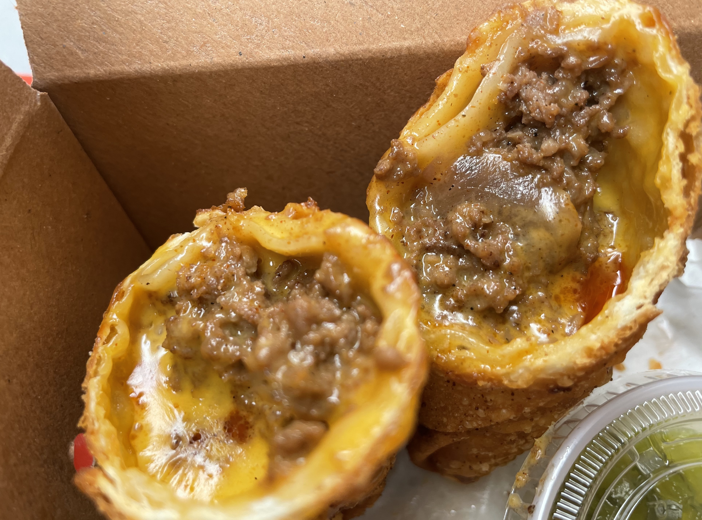

<a href='https://www.eatniceday.com/' target='blank'>Nice Day Chinese Takeout</a> (f.k.a. Junzi Kitchen) in Greenwich Village specializes in Chinese takeout classics ‘remixed’ with American comfort foods, and expertly toes the line between traditional flavors and resplendent creativity. 

I popped into Nice Day earlier this afternoon with the plan to pick up one of their Cheeseburger Egg Rolls, which has been on my ‘must-eat-again’ list ever since I first tried one earlier this summer. After a quick menu consultation, I also decided the time was as good as any for mapo mac and cheese. 

<i>Did I want that with or without sausage?</i> queried the friendly cashier. 

Well, I had eaten about six cookies earlier as part of a soon-to-be-revealed neighborhood ranking, and was also recovering from a cheeseburger-chorizo double-lunch — but yes, Ms. Cashier, you bet your bottom dollar I want sausage in my mapo mac and cheese. 

The Cheeseburger Egg Roll was as hefty as I remembered, holding about a Happy Meal’s worth of beef and cheddar. I ventured dipping the roll into the side of mustard and relish, which turned out to be a delightful cheat code. The sharp mustard flavor cut the saucy, meaty umami of the roll with a pungent kick; every bite had plenty of cheese, steaming-hot and redolent of chili-oil. 

  

I was delighted by the multiple full-bodied textures in the mapo mac and cheese; deep-fried tofu cubes shared equal footing with savory Chinese sausage. Heady shiitake mushrooms were also in the mix. The creamy mapo and sharp cheddar sauce was subtly cheesy, and ultimately, a great blanket for macaroni. 

I give Nice Day an 8.7; I love this place, and not just because they stuff cheeseburgers into fried egg rolls. The staff is friendly, the menu is inspired, and frankly, they’re the absolute best option for a cheat meal when I’m tired of the routine burgers-and-fries. 

Nice Day — formerly known as Junzi — and yet a rose by any other name…

Until next time. 

