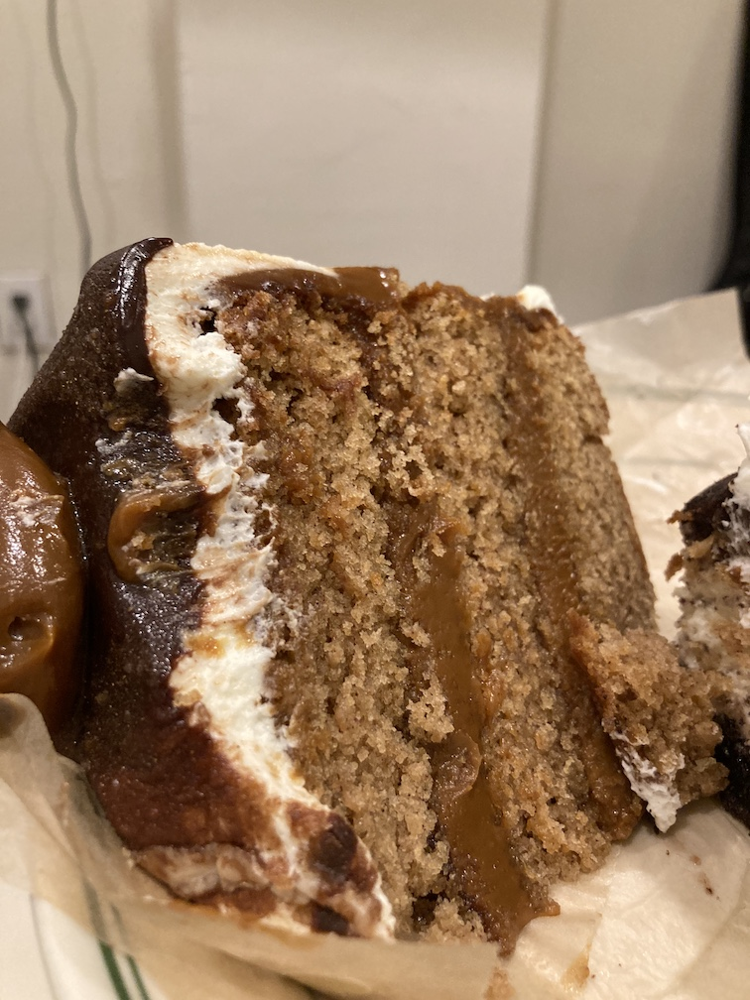

I was in the mood to experiment yesterday. Maybe I was inspired by the hot new blog layout, or maybe I was just just delirious from the 90-degree heat wave; in either case, the time was ripe for getting my <a href='https://www.kingjamesbible.me/Isaiah-43-19/#:~:text=%E2%80%9CBehold%2C%20I%20will%20do%20a,and%20rivers%20in%20the%20desert.%E2%80%9D' target='blank'>Isaiah 43:19</a> on and trying a new thing. 

Cue a jaunt up the block to <a href='https://www.instagram.com/poshpopbakeshop/?hl=en' target='blank'>Posh Pop Bakeshop</a>, the pink-plastered Bleecker Street storefront with over 100k Instagram followers and a maximalist array of mega-sized cookies, candy-stuffed brownies and post-impressionist colored layer cakes. 

As I considered the abundance of attention-grabbers in the display case, the Churro Dulce de Leche layer cake seemed to call to me. Frosted with dreamy swirls of caramel, chocolate and vanilla buttercream, I was drawn to the cake with the same intuition some people are drawn to choose a puppy out of a litter: deep called unto deep, and I had to respond. 

I also picked up a Cookies & Cream Cheesecake Brownie, because I don’t eat enough brownies, and also, when is cookies & cream not a good idea?

Plating the pastries at home turned out to be a challenge; I was pretty sure my fork was going to bend under the full heft of the churro cake, and the mile-high cheesecake jiggled precariously with every slight movement. I was able to eventually make the transfers with minimal loss of structural integrity; a few perfunctory snaps from the iPhone later, and I was finally to the races. 

First up was the Cookies & Cream Cheesecake Brownie, which turned out to be more cheesecake then brownie. The brownie aspect was primarily embodied in the crumbly and moist crust; the cheesecake was fairly light and fluffy, with swirls of familiar cookies-and-cream flavor throughout. An Oreo (or gluten-free equivalent chocolate cookie?) plopped atop a subtly sweet cloud of whipped cream was the final textural touch; the whole thing was a joy to eat from start to finish. 

I was left not overly full from the cheesecake and ready to immediately dig into the Caramel Dulce de Leche, which turned out to be the star of the whole sugar-parade.

  

Above all else, the cake was moist. Just really, really moist — and this is not a common attribute for gluten-free cakes. Each bite was redolent of cinnamon-sugar, and mixed in with generous doles of chocolate and caramel frosting, actually delivered the sensation of eating real churros. 

As I licked the frosting of the wax paper and considered my score for the review, I realized my 5-point rating scale has been rendered moot by the parade of perfect food I’ve reviewed. I’ll develop another quantitative rating scale at some point, but in the meantime, just take my recommendation for Posh Pop — this maximalist bakeshop is absolutely worth the calories if you’re visiting Greenwich Village. 

Now, time to tear up the elliptical machine and burn off those calories. 

Until next time. 
