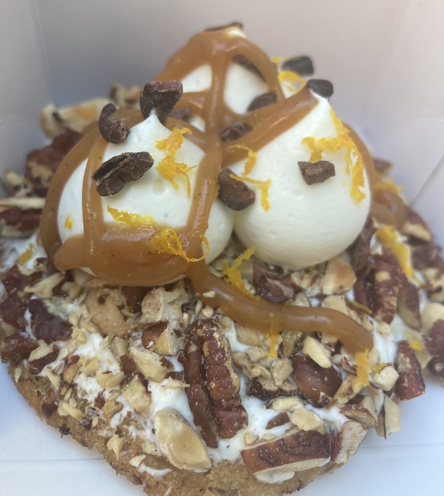

I live right above <a href='https://www.instagram.com/sweetrehabny/?hl=en' target='blank'>Sweet Rehab</a> — a Sullivan Street storefront with imported Parisian furniture and a distinctive honeybee logo — and am greeted with the smell of toasting butter and sugar whenever I walk into the apartment lobby. Yes, I am blessed.

But even as a neighbor, I only step into Sweet Rehab about once every few months. The pastries are sculpted and multi-layered design pieces; master baker David Zaquine — the son of a chocolatier and a fashion designer — says his inspiration “mostly comes from fashion.”

Just like high-fashion, the artistic experience is as important as the actual consumption; most desserts here are constructed on the spot. Locally-sourced fruits, honey and nuts feature heavily on the menu.

And every single item I've had at Sweet Rehab has tasted — what’s the French word? — <i>magnifique.</i>

Today, for no particular reason other than the weather was beautiful and I had actually finished my Central Park run, I decided to start the morning off with some Sweet Rehab luxury.

I already knew part of my order would include the Caramel Dulce de Leche cookie. I’m not even sure this cookie is comparable to others in downtown Manhattan — and there are plenty — because, for about $12, you’re not getting just a cookie. The full dessert comes dolloped with pouffes of sweet cream, a shower of crushed walnuts and hazelnuts, (I think) cacao nibs, and generous squirts of caramel sauce.

  

Eye-rolling; moaning; time-freezing; all these are common psycho-physical and temporal effects as you dig into the cookie. The buttery crunch of nuts gives way to pure cream and chocolate-laced dough, making for an experience that you’ll want to stretch out, licking each fingertip, rolling each bite in your mouth for full mouth-feel.

I also treated myself to a vanilla eclair, studded with bits of shortbread cookies (I believe the fancy French equivalent of Nilla wafers.) The cigar-shaped pastry was generously stuffed from end-to-end with rich Tahitian vanilla cream. The slightly crusty dough was thin but firm, holding together a perfectly sized, refreshing follow-up to the decadent cookie.

Sweet Rehab, needless to say, gets a 5 out of 5. I can’t believe I live above this parthenon of pastry excellence.

Until next time.
